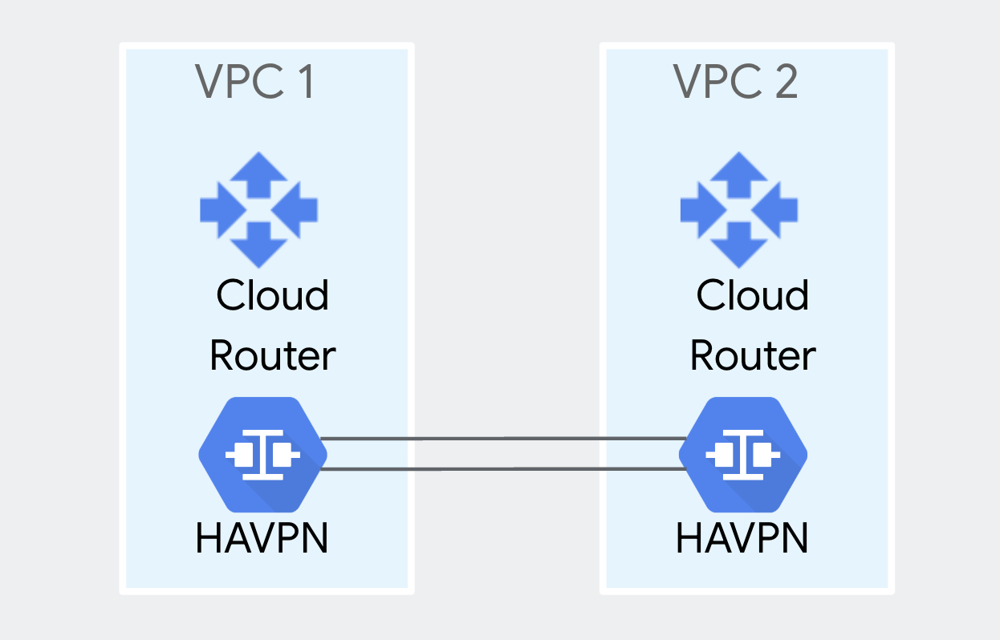

# HA-VPN Between 2 VPCs



## Notes
* The intent of this repo is to create a fixed environment for learning, demonstration, and proofs of concept (PoCs), **not production**.
* The script sets the Google Cloud org policy constraints/iam.allowedPolicyMemberDomains to allow all at the project level, so the script may fail in highly regulated environments.
* The actions taken by deploying this repo will add cost. To minimize costs, instructions are provided for how to teardown the demo environment. For more on cost, please refer to Google Cloud public pricing pages for components such as HA VPN and Data Transfer. 

## Setup instructions

1. Clone the this repo

```sh
git clone https://github.com/kurtradecki/gcp-vpn-vpc-demo.git
```

2. Ensure you have an active GCP account selected to run gcloud commands with [gcloud CLI](https://cloud.google.com/sdk/docs/install) (not needed in Cloud Shell).

```sh
gcloud auth login
gcloud auth application-default login
```

## Deploy the script

To deploy the script, follow this process:
1. Create a project in GCP, if not already created. Reference if needed [Creating and managing projects](https://cloud.google.com/resource-manager/docs/creating-managing-projects)
2. Rename example.tfvars to terraform.tfvars
3. In terraform.tfvars, add the values for variables that need values (see the file for which). All other values can stay the same unless customization required. Reference if needed for how to find project ID, see [Find the project name, number, and ID](https://cloud.google.com/resource-manager/docs/creating-managing-projects#identifying_projects)
4. At the command prompt where you'll run the script, in the Terraform directory, run:

```sh 
terraform init
terraform plan
terraform apply -auto-approve
```

4. Wait a few minutes for the script to complete. You'll see a message similar to "Apply complete!" and then move to the next section.

## Test reachability across the VPN

To test control plane and data plane, add a VM in each VPC and firewall rules to allow at least icmp, then ping between the VMs. 

## Conclusion & Cleanup

Congratulations! You've successfully deployed the script.

To delete the created infrastructure, run the following command:

```sh
terraform destroy -auto-approve
```

Wait a few minutes for the components created by the Terraform script to be removed. You'll see a message similar to "Destroy complete!" 
